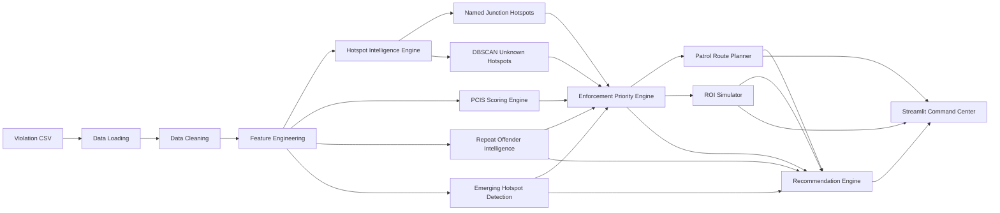

# AI Parking Intelligence & Enforcement Planning System Architecture

## Purpose

This project builds an AI-assisted enforcement planning system for PS1: Poor Visibility on Parking-Induced Congestion. It converts historical parking violation records into hotspot intelligence, congestion-impact estimates, emerging hotspot alerts, repeat offender intelligence, enforcement priorities, patrol sequences, and intervention simulations.

The system must primarily use the provided violation dataset only. It must not depend on traffic speed, travel time, road width, lane count, traffic APIs, Google Maps traffic, or OSM road-network analysis.

## Dataset Contract

Primary input:

- `latitude`
- `longitude`
- `location`
- `vehicle_number`
- `vehicle_type`
- `violation_type`
- `created_datetime`
- `police_station`
- `junction_name`
- `validation_status`
- `center_code`

The current source CSV also includes operational columns such as `id`, `description`, `offence_code`, device metadata, update fields, and validation timestamps. These may be preserved for traceability but are not required by the core intelligence engines.

## System Modules



## Application Architecture

The system is structured as three layers:

### Data Layer (Phases 1-3, batch pre-computation)

All intelligence is pre-computed by the batch pipeline and written to CSV.
No heavy computation occurs at serving time.

- Phase 1: Data cleaning, feature engineering, hotspot discovery.
- Phase 2: PCIS scoring, repeat offender intelligence, emerging hotspot detection.
- Phase 3: Enforcement priority ranking, patrol route planning, ROI simulation.

### Service Layer (Phase 4)

- `src/data_service.py`: Loads all pre-computed CSVs into memory at app
  startup via `@st.cache_data`. Provides clean query functions for the UI
  layer (station filtering, band filtering, sorted retrieval).
- `src/recommendation_engine.py`: Reads the pre-computed scores and applies
  presentation-layer rules to generate per-station actionable recommendations.
  Not a new analytical model — a view-layer transformation that synthesises
  existing signals into four recommendation types:
  1. **Deploy Patrol** — attaches route, priority context, and offender targets.
  2. **Emerging Threat Alert** — triggered by drift_score >= 70 on Emerging hotspots.
  3. **Repeat Offender Interception** — identifies high-value targets at specific hotspots.
  4. **Resource Allocation Advisory** — runs station-scoped ROI projection.

### Presentation Layer (Phase 4)

Streamlit multi-page application with 8 screens:

1. **Command Center** — citywide KPIs, station leaderboard, critical hotspot
   mini-map. The situation-awareness entry point.
2. **Action Center** — per-station actionable recommendations. The operational
   hub where intelligence becomes enforcement decisions. Synthesises PCIS,
   drift, repeat offenders, and patrol routes into prioritised action cards.
3. **City Risk Map** — interactive Folium map of all 701 hotspots with
   priority-band colouring, station filtering, and click-to-detail popups.
4. **Emerging Hotspot Alerts** — drill-down into drift-detected acceleration.
5. **Repeat Offender Intelligence** — vehicle-level detail with search.
6. **Enforcement Priority Rankings** — full sortable/filterable priority table
   with score decomposition.
7. **Patrol Planner** — route map with polyline, stop-by-stop table, and
   distance computation.
8. **ROI Simulator** — interactive what-if sliders for resource deployment
   modelling.

Screen hierarchy:

```
Command Center  -->  ACTION CENTER  -->  Detail / Execution screens
   (situation)       (recommendations)   (investigate or act)
```

## Phase 1 Components

- `src/config.py`: Central paths, thresholds, and scoring constants.
- `src/data_loader.py`: Streaming CSV loader and schema validation.
- `src/preprocessing.py`: Record cleaning and feature engineering.
- `src/hotspot_engine.py`: Named hotspot aggregation and DBSCAN unknown hotspot discovery.
- `run_phase1.py`: Batch entry point for Phase 1 processing.

## Phase 2 Components

- `src/pcis_engine.py`: PCIS scoring engine.
- `src/repeat_offender.py`: Repeat offender intelligence.
- `src/emerging_hotspots.py`: Emerging hotspot detection.
- `run_phase2.py`: Phase 2 batch entry point.

## Phase 3 Components

- `src/enforcement_priority.py`: Enforcement priority ranking engine.
- `src/patrol_planner.py`: Patrol route planner.
- `src/roi_simulator.py`: ROI simulator.
- `run_phase3.py`: Phase 3 batch entry point.

## Phase 4 Components (Planned)

- `src/data_service.py`: In-process data service. Loads CSVs, caches in
  memory, provides query functions.
- `src/recommendation_engine.py`: Recommendation rule engine. Generates
  per-station action cards from pre-computed signals.
- `app.py`: Streamlit entry point.
- `pages/1_Command_Center.py` through `pages/8_ROI_Simulator.py`: Screen
  implementations.

## Phase 1 Outputs

- `data/processed/cleaned_violations_sample.csv`
- `data/processed/named_hotspots.csv`
- `data/processed/unknown_hotspots.csv`
- `data/processed/hotspot_summary.csv`
- `reports/phase1_summary.txt`

Latest full Phase 1 run:

- Raw records scanned: 298,450
- Clean records retained: 298,450
- Records dropped: 0
- Named junction records: 150,565
- `No Junction` records: 147,885
- Named hotspots generated: 303
- Unknown DBSCAN hotspots generated: 398
- DBSCAN radius: 75 meters
- DBSCAN minimum samples: 20

Top severity examples from the full run:

- Unknown Hotspot U-0005, K.R. Pura
- Unknown Hotspot U-0021, Chikkajala
- BTP058 - Subbanna Junction, Upparpet
- BTP083 - AS Char Street, Mysore Road, City Market
- BTP082 - KR Market Junction, City Market

## Architectural Constraints

- All scoring must be explainable and derived from violation data.
- Unknown hotspot discovery must use only latitude/longitude clustering from records without named junctions.
- Patrol planning may sequence hotspot centroids using approximate geodesic distance, but it must not use road network routing.
- The application must present enforcement decisions and actionable recommendations, not just descriptive charts.
- The Action Center must synthesise all intelligence signals into per-station recommendations — it must not simply repeat individual screen content.
- The recommendation engine must be a presentation-layer rule engine, not a new analytical model. All heavy computation is done in the batch pipeline.

